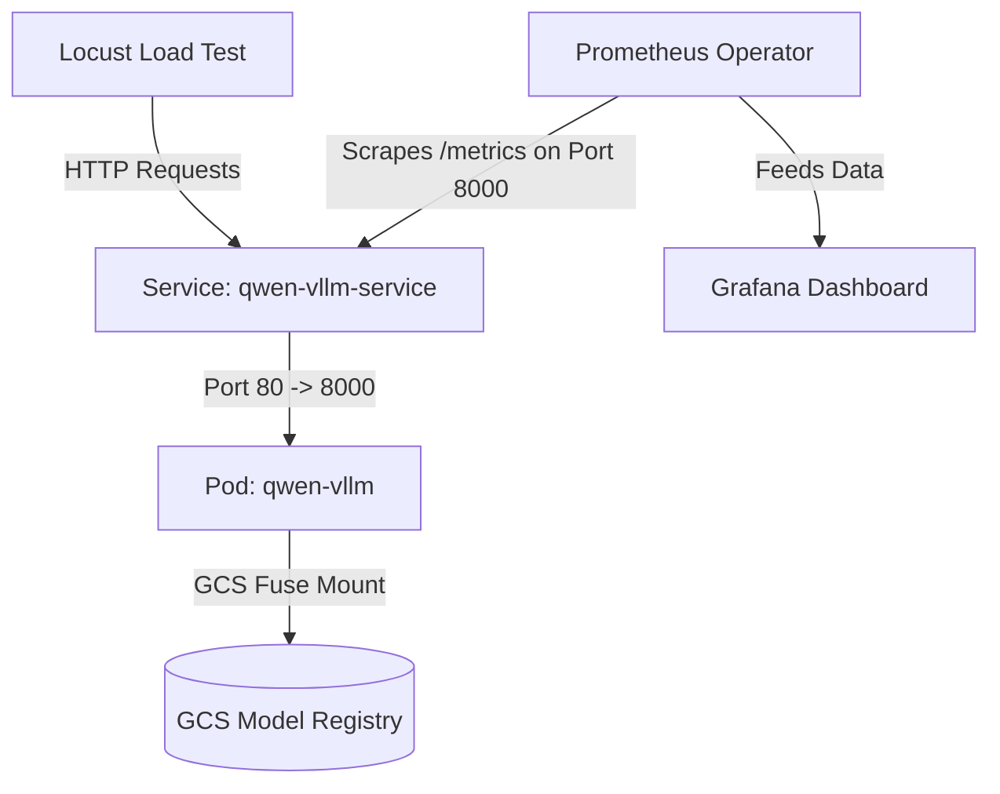

# Deploying and Monitoring vLLM on GKE Autopilot with NVIDIA L4 GPU

This repository contains the complete infrastructure code, configuration manifests, and load-testing scripts to deploy a production-grade, auto-instrumented **vLLM** engine serving a quantized **Qwen2.5-0.5B-Instruct** model on **Google Kubernetes Engine (GKE) Autopilot**.

It features automated GCS Fuse CSI model mounting, custom vLLM metrics scraping via Prometheus Operator, and real-time visualization in Grafana.

---

## 🏗️ Architecture Overview



*   **Model Serving:** vLLM (`v0.4.3`) deployed on a single NVIDIA L4 GPU (24GB VRAM).
*   **Weights Storage:** Dynamic GCS Fuse CSI driver volume mount (no local disk/PV pre-warming needed).
*   **Telemetry:** Kube-Prometheus-Stack adapted for GKE Autopilot security policies.
*   **Scraping:** Custom `ServiceMonitor` targeting vLLM metrics endpoint.
*   **Load Testing:** Headless Locust test capturing streaming TTFT and ITL client-side statistics.

---

## 🚀 Step-by-Step Deployment Guide

### 1. GCP Infrastructure Setup
Configure Google Cloud Services, create a GCS bucket to act as your model registry, and configure a Google Service Account (GSA) bound to the Kubernetes Service Account (KSA) using GKE Workload Identity.

Run the setup script:
```bash
chmod +x gcp-setup.sh
./gcp-setup.sh
```

### 2. GKE Autopilot Cluster Provisioning
Provision a GKE Autopilot cluster. GKE Autopilot automatically manages node auto-provisioning and dynamically installs the correct NVIDIA GPU drivers when a GPU pod is requested.
```bash
chmod +x gke-cluster-setup.sh
./gke-cluster-setup.sh
```

### 3. Model Quantization & Upload
To optimize VRAM footprint and throughput, quantize the model weights (e.g., AWQ 4-bit) and upload them to your GCS registry.
```bash
# Quantize weights (requires a GPU-enabled workspace)
python3 quantize_awq.py

# Upload model directory to GCS
gcloud storage cp -r ./Qwen2.5-0.5B-Instruct-AWQ gs://<YOUR-PROJECT-ID>-ml-model-registry/
```

### 4. Deploy vLLM
Deploy the vLLM deployment, service account, and service:
```bash
kubectl apply -f vllm-gke-deployment.yaml
```
*Note: GKE Autopilot will detect the `nvidia.com/gpu: 1` request and dynamically provision an `nvidia-l4` node. This process takes 2-4 minutes.*

---

## 📊 Telemetry and Observability Setup

GKE Autopilot enforces strict namespace boundaries and disallows host-privileged DaemonSets. Installing standard Helm charts like `kube-prometheus-stack` out-of-the-box fails. 

### 1. Install Prometheus and Grafana (Autopilot Compatible)
We bypass these restrictions by using [prometheus-values.yaml](prometheus-values.yaml) to disable node-exporters and restricted control-plane metrics.

```bash
kubectl create namespace monitoring || true
helm repo add prometheus-community https://prometheus-community.github.io/helm-charts
helm repo update
helm install prometheus prometheus-community/kube-prometheus-stack \
    -n monitoring \
    -f prometheus-values.yaml
```

### 2. Scrape vLLM Metrics
Apply the [vllm-service-monitor.yaml](vllm-service-monitor.yaml) configuration to register vLLM with the Prometheus target collector:
```bash
kubectl apply -f vllm-service-monitor.yaml
```
*Note: vLLM serves prometheus metrics on its main OpenAI API port (8000) under `/metrics`. The ServiceMonitor points to the `http` service endpoint to map this correctly.*

### 3. Port-Forward Services
To access Grafana and vLLM APIs locally:
```bash
# Port-forward Grafana
kubectl port-forward svc/prometheus-grafana 3000:80 -n monitoring &

# Port-forward vLLM
kubectl port-forward svc/qwen-vllm-service 8000:80 -n kserve-test &
```

### 4. Import Grafana Dashboard
1. Open Grafana at `http://localhost:3000` (User: `admin` / Password: `admin-gke-mlops`).
2. Go to **Dashboards > New > Import**.
3. Copy-paste the content of [vllm-grafana-dashboard.json](vllm-grafana-dashboard.json) (or upload the file) and select the `Prometheus` datasource.

---

## 🧪 Load Testing (Locust)

The [locustfile.py](locustfile.py) load test sends streaming requests (`stream: true`) to the vLLM endpoint and calculates **TTFT (Time-to-First-Token)** and **ITL (Inter-Token Latency)** client-side.

Run a headless load test simulating 5 concurrent users for 2 minutes:
```bash
locust --headless -u 5 -r 1 --run-time 2m --host http://localhost:8000
```

### Expected SLA Outputs (NVIDIA L4)
Under concurrent retail shopping shopper simulations, you should observe:
* **P90 Server TTFT:** **~34 ms** (time-to-first-token generation on GPU).
* **P90 Server ITL:** **~9.0 ms** (time-per-output-token).
* **Throughput:** ~110 tokens/sec.
* **Error Rate:** 0.0%.

---

## 💡 Key Troubleshooting Wins & Gotchas Resolved

1. **GKE Autopilot Quota Deadlocks:** During rolling deployments, requesting a new GPU pod when quota is set to `1.0` results in scheduling failures because the old pod holds the GPU. Resolved by setting `spec.strategy.type: Recreate` to ensure the old container terminates before the new one starts.
2. **GKE Autopilot Prometheus Restrictions:** Bypassed Helm installation blocks by disabling host-privileged `node-exporter` DaemonSets and disabling scraping of protected `kube-system` control-plane namespaces.
3. **vLLM Metrics Port Alignment:** vLLM serves its `/metrics` endpoint on the primary listener port `8000`, not a separate port. Changed the `ServiceMonitor` endpoint from port `metrics` (8090) to `http` (8000) to resolve connection refused errors in Prometheus targets.
