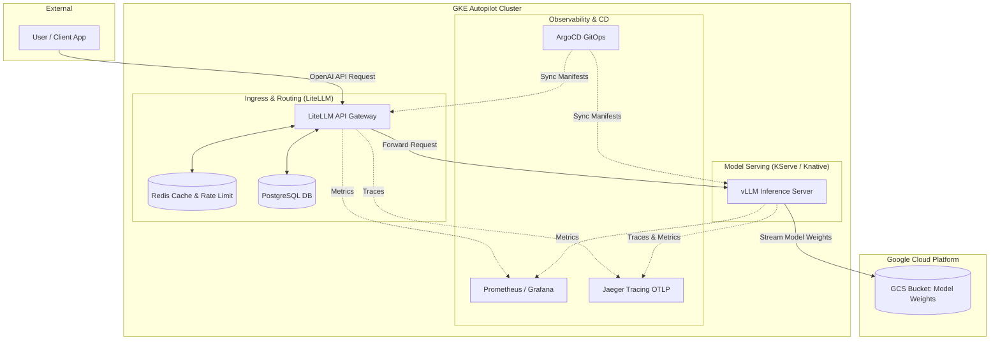

# Enterprise LLM Serving Architecture on GKE Autopilot

This repository demonstrates a production-grade, highly scalable, and observable architecture for serving Large Language Models (LLMs) on Google Kubernetes Engine (GKE). It is designed to bridge the gap between AI Engineering and MLOps, focusing on reliability, cost-control, and GitOps deployment practices.

## 🏗 Architecture Diagram



## 🚀 Key Components

1. **LiteLLM Gateway:** Acts as the entry point, providing an OpenAI-compatible API. It handles authentication, per-project budgets, rate limiting (via **Redis**), routing, and fallbacks. Configuration is stored in **PostgreSQL**.
2. **KServe & vLLM:** KServe manages the lifecycle of the model endpoints (InferenceServices). **vLLM** acts as the high-throughput inference engine, leveraging PagedAttention for optimal GPU memory utilization.
3. **GCS Fuse CSI:** Model weights (like Qwen 0.5B) are stored in Google Cloud Storage. Instead of baking weights into massive Docker images, GCS Fuse dynamically mounts the bucket directly into the vLLM container at startup.
4. **Observability:** Distributed tracing is handled via OpenTelemetry (OTLP) exporting to **Jaeger**. Metrics are scraped by **Prometheus** and visualized in **Grafana**.
5. **GitOps:** **ArgoCD** continuously monitors this Git repository and ensures the cluster state matches the declarative manifests.

---

## 🛠 Production Operations & Interview Talking Points

### 1. Autoscaling & Scale-to-Zero
* **Knative Serving:** Under the hood, KServe utilizes Knative. This allows the InferenceService to scale down to **zero pods** when there is no traffic, ensuring we don't pay for idle GPUs.
* **GKE Autopilot Autoscaler:** When Knative scales the deployment up from 0 to 1, GKE Autopilot intercepts the pod's resource requests (e.g., 1 NVIDIA T4 GPU) and dynamically provisions a compute node to fulfill it. When the pod terminates, Autopilot deletes the node.

### 2. GPU Memory Management (vLLM)
GPU memory (VRAM) is the most critical bottleneck in LLM serving. This architecture utilizes vLLM to optimize it:
* **PagedAttention:** Radically reduces memory waste in the KV cache, allowing for larger batch sizes.
* **`--gpu-memory-utilization`:** Configured to `0.90` (90%), explicitly telling vLLM to reserve 90% of the VRAM for the KV cache and weights, leaving 10% for PyTorch overhead.
* **`--max-model-len`:** Capped at 4096 tokens to prevent out-of-memory (OOM) errors from users submitting massive context windows.
* **Prefix Caching:** Enabled (`--enable-prefix-caching`) so if multiple users send prompts with the same system instructions, the KV cache for that prefix is shared, saving massive amounts of VRAM.

### 3. Cost Control & Rate Limiting
Serving LLMs can get expensive rapidly. 
* **LiteLLM Budgets:** We use LiteLLM backed by Redis to enforce strict API rate limits and monthly cost budgets per API key. If a user tries to scrape the endpoint, LiteLLM blocks them before the request even reaches the expensive GPU.
* **Spot Instances:** In a true production environment, GKE Autopilot can be configured to provision *Spot* GPU instances for non-critical batch processing, saving up to 70% on compute costs.

### 4. Distributed Tracing & Monitoring
Because an LLM request passes through a Gateway, a Service Mesh, and an Inference Engine, debugging latency is difficult.
* **Jaeger OTLP:** Both LiteLLM and vLLM are configured to emit OpenTelemetry traces to Jaeger. A single trace ID follows the request from the moment the user hits LiteLLM to the exact millisecond vLLM starts generating tokens.
* **Prometheus:** Scrapes GPU utilization, KV cache usage, and token generation speeds from vLLM to trigger alerts if throughput degrades.

### 5. Troubleshooting Common GCP Quota Issues
When deploying GPUs on Google Cloud, you will inevitably hit provisioning errors. Knowing the difference is crucial:
* **`GCE quota exceeded`:** Your Google Cloud Billing Account has a hard limit of `0` for that specific GPU type (e.g., L4 GPUs). You must request a quota increase in the GCP IAM Console.
* **`GCE out of resources`:** You *do* have quota, but the physical Google Cloud datacenter in that specific zone (e.g., `us-central1-b`) is completely sold out of hardware. The cluster autoscaler will automatically backoff and retry across other zones (e.g., `us-central1-c`) until it finds availability.

---

## 💻 Local Testing UI

To test the architecture end-to-end, a local Streamlit Chatbot (`streamlit_app.py`) is provided. It acts as the client, connecting to the LiteLLM Gateway via a local `kubectl port-forward`.

```bash
# Install dependencies
pip install streamlit openai

# Run the UI locally
python3 -m streamlit run streamlit_app.py
```
